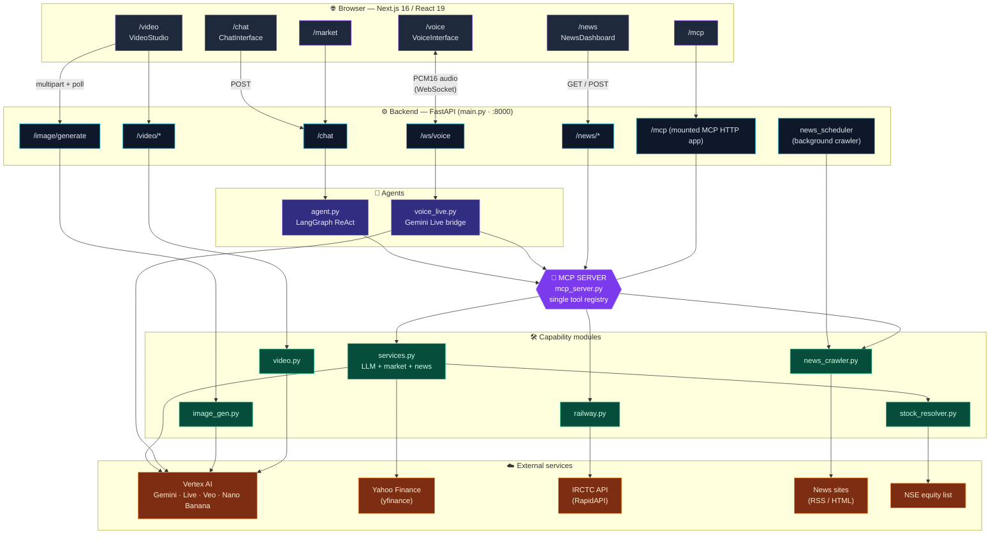
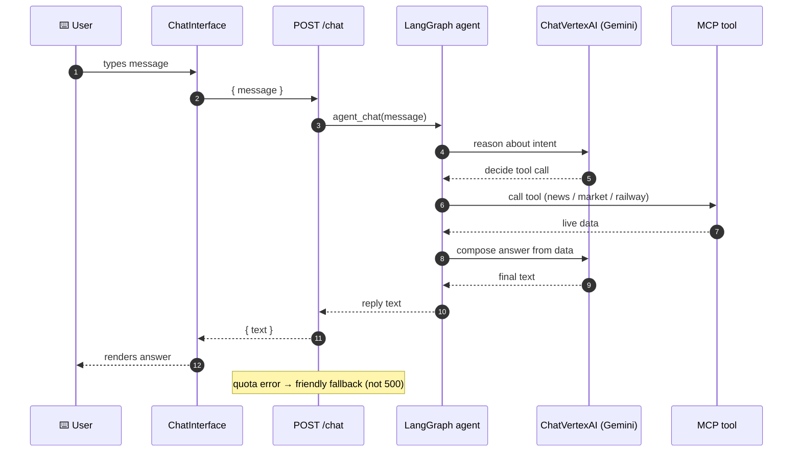
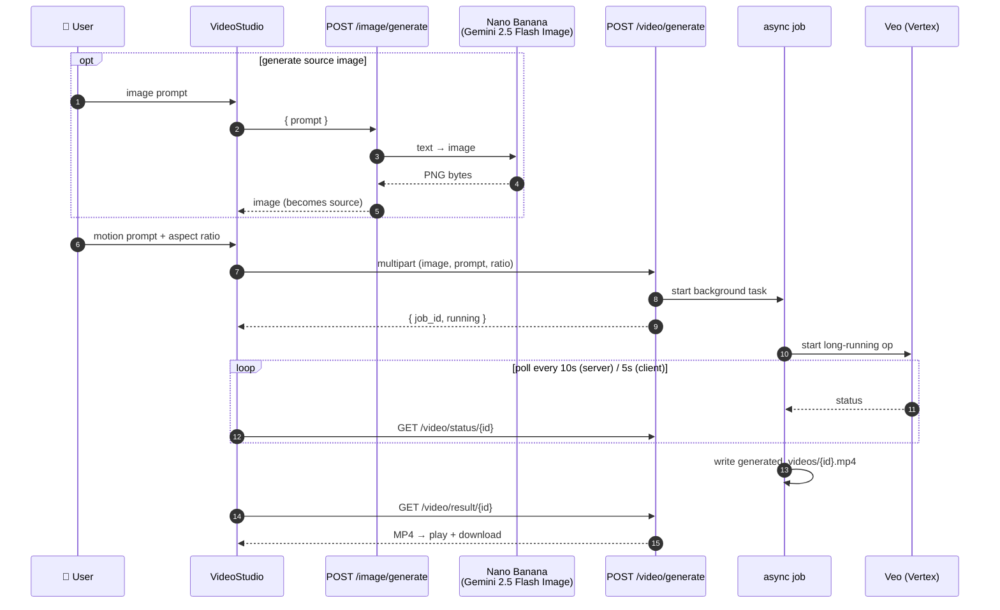
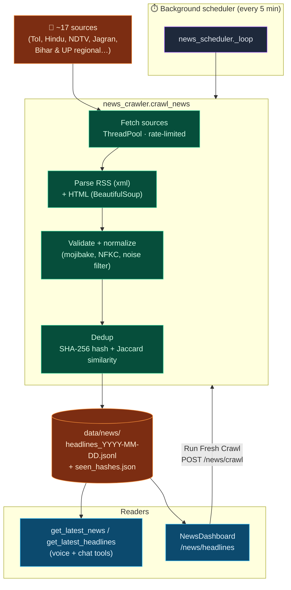
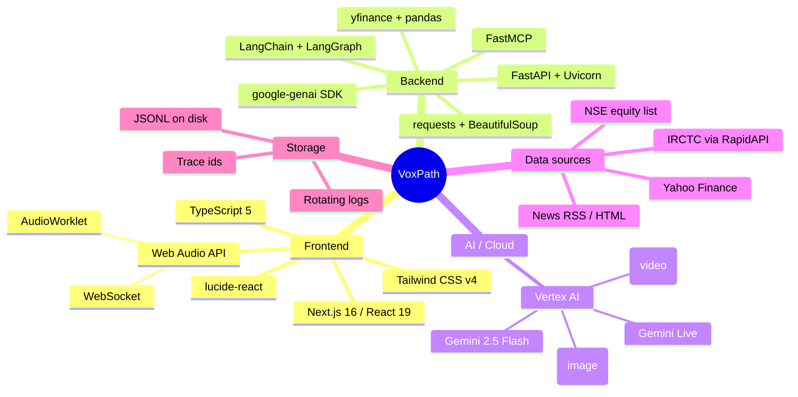

---
pdf_options:
  format: A3
  margin: 20mm
  landscape: true
---

# VoxPath — Visual Overview

A set of diagrams that show how VoxPath fits together: the system architecture,
the shared tool layer, and the main request flows (voice, chat, image→video, news).

---

## 1. System Architecture



---

## 2. The MCP Tool Layer — "Two agents, one registry"

```mermaid
flowchart LR
    subgraph SURFACES["User surfaces"]
        TXTUSER["⌨️ Text chat"]
        VOICEUSER["🎙️ Live voice"]
    end

    subgraph A["Agents"]
        AGENT["agent.py<br/>LangChain StructuredTools<br/>(subset of tools)"]
        VL["voice_live.py<br/>Gemini Live<br/>FunctionDeclarations"]
    end

    REG{{"🧩 FastMCP registry<br/>call_tool(name, args)"}}

    subgraph TOOLS["Registered MCP tools"]
        direction TB
        T1["get_latest_news"]
        T2["get_latest_headlines"]
        T3["crawl_news"]
        T4["get_stock_price"]
        T5["market_report"]
        T6["get_pnr_status"]
        T7["resolve_station_code"]
        T8["get_live_train_status"]
        T9["get_train_schedule"]
        T10["search_trains"]
        T11["check_seat_availability"]
        T12["get_fare"]
    end

    subgraph RES["MCP resources"]
        R1["voxpath://health"]
        R2["voxpath://capabilities"]
        R3["voxpath://news/sources"]
    end

    TXTUSER --> AGENT --> REG
    VOICEUSER --> VL --> REG
    REG --> TOOLS
    REG -.-> RES

    classDef u fill:#1e293b,stroke:#7c3aed,color:#e2e8f0;
    classDef ag fill:#312e81,stroke:#a78bfa,color:#ede9fe;
    classDef rg fill:#7c3aed,stroke:#c4b5fd,color:#ffffff;
    classDef tl fill:#064e3b,stroke:#34d399,color:#d1fae5;
    classDef rs fill:#0c4a6e,stroke:#38bdf8,color:#e0f2fe;
    class TXTUSER,VOICEUSER u;
    class AGENT,VL ag;
    class REG rg;
    class T1,T2,T3,T4,T5,T6,T7,T8,T9,T10,T11,T12 tl;
    class R1,R2,R3 rs;
```



---

## 3. Live Voice Flow (voice‑to‑voice)

```mermaid
sequenceDiagram
    autonumber
    participant U as 🎙️ User
    participant B as Browser<br/>(AudioWorklet)
    participant WS as /ws/voice
    participant G as Gemini Live<br/>(Vertex, global)
    participant MCP as MCP tool

    U->>B: speaks
    B->>WS: 16kHz PCM16 (binary frames)
    WS->>G: forward audio (Blob)
    Note over G: server-side VAD<br/>detects end of turn
    alt model needs live data
        G->>WS: tool_call
        WS->>MCP: call_tool(name, args)
        MCP-->>WS: result (dict)
        WS->>G: FunctionResponse
    end
    G->>WS: 24kHz PCM16 answer + transcripts
    WS->>B: audio frames + JSON control
    B->>U: plays answer (jitter-buffered)
    Note over B: mic muted while speaking<br/>(half-duplex); barge-in flushes playback
```

---

## 4. Text Chat Flow



---

## 5. Image → Video Flow



---

## 6. News Subsystem



---

## 7. Technology Stack at a Glance



---

*Diagrams rendered with Mermaid. Edit this file and regenerate the PDF/PNG to keep
the visuals in sync with the code.*
```