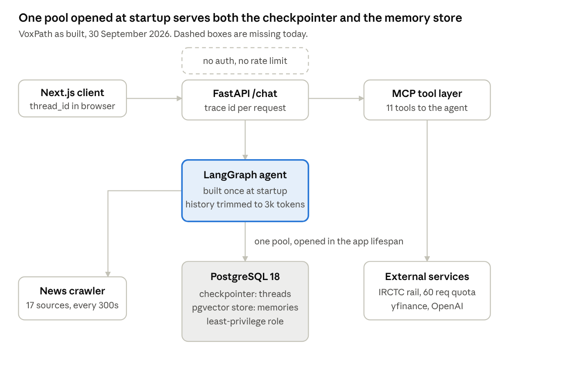
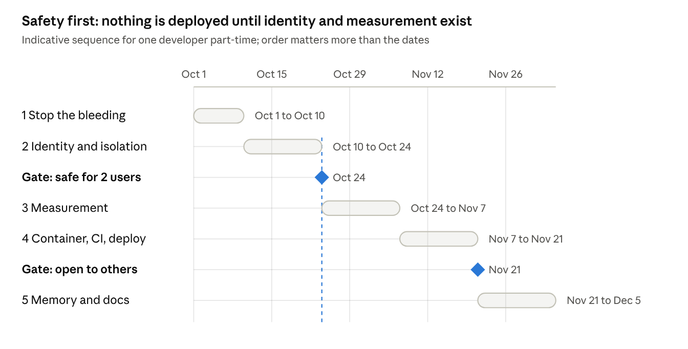

# VoxPath: Constitution, Tech Spec & Implementation Plan

30 September 2026 · Kripa Shankar

> Local copy of the living document at
> <https://claude.ai/code/artifact/c98c67ab-44d6-4198-bd78-0636bdde30fd>.
> Edit the online version; this file is an export.

## Purpose

VoxPath today is a working prototype with unusually good persistence engineering and no production safety net; this document sets the rules, the target design and the sequence to close that gap.

It has three parts, meant to be read in order and used separately afterwards:

1. **The constitution** — the principles that decide arguments. Stable; changes rarely.
2. **The technical specification** — what exists today, what is wrong, and what the target system looks like.
3. **The implementation plan** — the phased sequence, with acceptance criteria per phase.

**The honest verdict.** VoxPath does several things that most projects of its size get wrong: one connection pool owned by the app lifespan, the agent built once at startup, conversation isolation by thread, a least-privilege database role, context trimmed to a token budget. It also has no authentication, no rate limiting, no deployment, no CI, and no way to say how good its answers are. Two defects reached users in the last day: a Windows code-integrity block that crashed startup, and a rate-limited API reported to the user as "there are no trains."

The gap to world class is not a list of features. It is **measurement, isolation and failure behaviour**.

## Part 1 — The constitution

Twelve rules. Each one exists because breaking it has already cost something, here or in systems like this. Each has a test: a way to tell whether the code obeys it.

**1. A failure must never be reported as a fact.**
A tool that cannot answer says so. It never returns an empty result that reads like knowledge about the world.
*Test:* every non-200 response path returns an error the model is instructed to relay as "I could not check," never as absence.
*Cost of breaking it:* on 30 September a rate-limited API produced "there are no trains from New Delhi to Patna." There were seventeen.

**2. Authorization lives in code, never in the prompt.**
Identity comes from the authenticated session. A user id supplied by the model, the client, or a tool argument is never trusted.
*Test:* a test attempts to read another user's data by every route — direct request, crafted argument, prompt injection — and fails.

**3. Every stored fact is namespaced by its owner.**
Memories, threads and checkpoints carry the authenticated user. No shared default bucket exists in production.
*Test:* no code path can reach a namespace of `"default"`.

**4. Expensive resources are opened once, by the application lifespan.**
Connection pools, agents and clients are created at startup and closed at shutdown. Never per request, never lazily on first use.
*Test:* no `global` initialised inside a request handler; startup logs name every resource it opened.

**5. Misconfiguration fails at boot, loudly.**
A missing key, an unreachable database or a broken tool registry stops the process with a readable message. It never surfaces as a 500 on a user's first request.
*Test:* removing each required environment variable produces a distinct startup error naming it.

**6. Quality is a number, not an opinion.**
No change to a prompt, model, retrieval setting or tool ships without a measured before and after on a fixed dataset.
*Test:* the evaluation suite runs in CI and can block a merge.

**7. Every external call is bounded.**
Timeout, retry limit with backoff, and a concurrency cap. Nothing waits forever or retries forever.
*Test:* no `requests` or client call without an explicit timeout; no retry loop without a maximum.

**8. Spending is capped before it is monitored.**
Per-user rate limits and a hard budget ceiling exist before the service is reachable by anyone else.
*Test:* an unauthenticated request is rejected; an authenticated one past quota is throttled, not served.

**9. Dependencies are pinned with bounds.**
Every dependency declares a lower and upper bound. Majors are adopted deliberately, never by accident.
*Test:* no unpinned line in `requirements.txt`.
*Cost of breaking it:* an unpinned `pandas` pulled in 3.0.5, whose unsigned binaries Windows then blocked, crashing startup.

**10. State lives in the database, so any replica can serve any request.**
No conversation, memory or session state in process memory.
*Test:* the service survives being scaled to three replicas behind a load balancer with no sticky sessions.

**11. Retrieved and tool-returned content is data, never instruction.**
News pages, API responses and stored memories cannot direct the agent's behaviour or trigger privileged tools.
*Test:* an injection planted in a mocked tool response fails to change the agent's actions.

**12. The documentation describes the system that exists.**
A README that is wrong is worse than none, because it is believed.
*Test:* a new developer can run the app from the README alone, without asking a question.

## Part 2 — What exists today

2,723 lines of Python across 16 modules, a Next.js frontend, 19 registered MCP tools and 3 resources, of which the agent uses 11, and a PostgreSQL database with pgvector. Status is judged against the constitution above, not against whether the code runs.

### Chat and agent

| Feature | Where | Status |
| --- | --- | --- |
| LangGraph ReAct agent on `gpt-4o-mini` | `agent.py` | Works |
| Agent built once in the app lifespan | `agent.py`, `main.py` | Solid |
| Tools loaded from one MCP registry | `mcp_server.py` | Solid |
| History trimmed to a 3,000-token budget | `agent.py` | Works |
| Quota and rate-limit fallback response | `main.py` | Works |
| Streaming responses | — | Missing |

### Tools available to the agent

| Tool | Domain | Backing service |
| --- | --- | --- |
| `get_latest_news` | News | Local crawler and store |
| `get_stock_price` | Markets | yfinance |
| `get_pnr_status` | Rail | IRCTC via RapidAPI |
| `resolve_station_code` | Rail | IRCTC via RapidAPI |
| `get_live_train_status` | Rail | IRCTC via RapidAPI |
| `get_train_schedule` | Rail | IRCTC via RapidAPI |
| `search_trains` | Rail | IRCTC via RapidAPI |
| `check_seat_availability` | Rail | IRCTC via RapidAPI |
| `get_fare` | Rail | IRCTC via RapidAPI |
| `save_memory` | Memory | pgvector store |
| `search_memories` | Memory | pgvector store |

Eight further tools exist in the MCP registry but are not exposed to the agent: `route_chat`, `general_chat`, `extract_market_tickers`, `market_report`, `list_news_sources`, `crawl_news`, `get_latest_headlines`, `handle_chat`.

### News subsystem

| Feature | Where | Status |
| --- | --- | --- |
| Crawler across 17 sources, including Bihar and UP regional | `news_crawler.py`, `news_config.py` | Works |
| Background refresher every 300 seconds | `news_scheduler.py` | Works |
| Local storage and retrieval of headlines | `news_storage.py` | Works |
| `/news/status` endpoint for refresher health | `main.py` | Works |

### Persistence and memory

| Feature | Where | Status |
| --- | --- | --- |
| One `AsyncConnectionPool` opened in the lifespan, shared by checkpointer and store | `main.py` | Solid |
| Postgres checkpointer for conversation history | `main.py` | Solid |
| `thread_id` per conversation, sent by the frontend | `ChatInterface.tsx`, `main.py` | Works |
| pgvector store, `text-embedding-3-small` at 1536 dimensions | `main.py`, `services.py` | Works |
| Memory save and semantic search | `memory.py` | Works, single-user |
| Memory update or delete | — | Missing |
| User namespacing wired end to end | — | **Missing — always `"default"`** |

### Security and operations

| Feature | Where | Status |
| --- | --- | --- |
| Least-privilege database role, verified isolated | PostgreSQL | Solid |
| Secrets in a gitignored `.env` | `backend/.env` | Adequate for local |
| CORS restricted to configured origins | `main.py` | Works |
| Structured logging with per-request trace ids | `logging_config.py` | Solid |
| Authentication | — | **Missing** |
| Rate limiting or cost caps | — | **Missing** |
| Metrics, tracing, cost tracking | — | Missing |
| Container image, CI, deployment | — | **Missing** |

### Frontend

| Feature | Where | Status |
| --- | --- | --- |
| Chat interface with markdown rendering | `ChatInterface.tsx` | Works |
| Thread id minted and persisted per browser | `ChatInterface.tsx` | Works |
| Clear conversation, starting a new thread | `ChatInterface.tsx` | Works |
| Backend health indicator | `ChatInterface.tsx` | Works |
| Local transcript cache | `ChatInterface.tsx` | Duplicates server state |

### Tests

21 tests in two files: `test_units_fast.py` (6, fast, passing) and `test_backend.py` (15, integration). No evaluation of answer quality or tool-routing accuracy.

## How it fits together today

The deliberate decisions worth keeping: one connection pool owned by the lifespan and shared by the checkpointer and the store, rather than the library helper that opens a single bare connection; the agent built once at startup so misconfiguration fails at boot; and a `thread_id` per conversation so histories stay separate. The dashed box is the hole everything else in this document follows from: requests arrive with no identity attached.

## Part 3 — Gap analysis

Twelve gaps, ranked by what they would cost if the app had users tomorrow. The first four are correctness or safety defects; the rest are maturity.

| # | Gap | Evidence | Breaks rule |
| --- | --- | --- | --- |
| 1 | **No authentication.** Any caller reaching the API spends the OpenAI budget and reads any conversation | No auth dependency anywhere in `main.py` | 2, 8 |
| 2 | **All memories share one namespace.** `user_id` is never supplied, so every user's facts land in `"default"` and surface for everyone | `memory.py` falls back to `DEFAULT_USER_ID` | 2, 3 |
| 3 | **Failures reported as facts.** A non-200 from the rail API falls through to "No trains found", which the model states as truth | `railway.py:422` has no `else`; 429 logged nowhere; user told no trains existed when 17 did | 1 |
| 4 | **No rate limiting or cost ceiling.** One loop or one abusive client can exhaust the API budget | No limiter in `main.py` | 8 |
| 5 | **No measurement of answer quality.** No golden set, no tool-routing accuracy, no regression gate. Yesterday's wrong answer was caught by a human, not a test | No evaluation suite in the repo | 6 |
| 6 | **No deployment path.** No container image; the app runs from a Windows PowerShell script and needs a selector event-loop workaround | No `Dockerfile`; `main.py` carries the Windows loop fix | 10 |
| 7 | **No CI.** Nothing runs the tests, scans dependencies or blocks a bad merge | No `.github/` directory | 6 |
| 8 | **Memory is append-only.** A changed fact is stored beside the old one; both are retrieved and the model picks | `save_memory` mints a fresh uuid every call; no update or delete tool | — |
| 9 | **Relevance threshold tuned on two data points.** Correct and incorrect score ranges already overlap (0.466 and 0.133 correct against 0.198 unrelated) | Measured and documented in `memory.py` | 6 |
| 10 | **Dependencies unpinned.** `pandas` and `yfinance` carry no bounds; `pandas` 3.0.5 arrived unasked and its unsigned binaries were blocked by Windows, crashing startup | `requirements.txt` lines 25–26 | 9 |
| 11 | **No observability beyond logs.** No metrics, traces, token or cost tracking. The rail outage left no trace in the log at all | Only `logging_config.py` | — |
| 12 | **Documentation describes a different application.** No README; `docs/` describes a voice-native Vertex AI app with image and video generation that no longer exists | `docs/TECHNICAL_DOCUMENTATION.md` | 12 |

### The two defects that reached a user this week

Both were invisible to the logs, which is the more important finding.

**A crash before logging started.** `import pandas` failed under Windows Smart App Control, which blocked the unsigned `.pyd` binaries. The traceback went to the console only; `logs/voxpath.log` still ended eighteen days earlier. Under `npm run dev` the frontend died with it, so the app appeared to fail for no reason. It is intermittent, which is worse than a consistent failure.

**A wrong answer delivered confidently.** The rail API returned 429. Station resolution logged it, because that path raises. The train search did not, because a 429 is an ordinary response object and the code only checks for 200. The empty result became "No trains found", and the model relayed it as fact. Nothing in the logs indicated the API had failed.

## Part 4 — Target technical specification

The target keeps today's architecture. Nothing here requires a rewrite; every item is an addition or a correction to an existing layer.

### Identity and access

- **Authentication** on every endpoint except `/health`. OAuth or OIDC against a hosted identity provider; a signed session token on each request, validated in a FastAPI dependency.
- **`user_id` derived from that token only.** Never from the request body, a tool argument, or the model.
- **Threads owned by users.** A `thread_id` is valid only for the user who created it; the checkpointer query carries the owner.
- **Memory namespaced** as `("memories", user_id)` with a real id, and the `"default"` fallback removed rather than left unused.

### Tool contract

Every tool returns one of three shapes, and the model is instructed to treat them differently:

| Shape | Meaning | The agent says |
| --- | --- | --- |
| `{"data": …}` | The call succeeded | Reports the data |
| `{"empty": true, "searched": …}` | The call succeeded and there is genuinely nothing | "There are none" |
| `{"error": …, "retriable": bool}` | The call failed | "I could not check right now" |

Every outbound call carries a timeout, a retry limit with exponential backoff and jitter honouring `Retry-After`, and a client-side concurrency cap so the agent's parallel tool calls cannot self-inflict a 429. Every non-200 is logged with status and body excerpt.

### Memory

- `save_memory` searches for a near-duplicate before inserting, and updates in place when one is found.
- `delete_memory` and `list_memories` exist, and the user can see and remove what the system has stored.
- The relevance floor is re-tuned against at least fifty real memories, and the tuning data is kept.
- Retrieval over-fetches before filtering by score, so duplicates cannot crowd out distinct facts.

### Evaluation

- **A golden set of 60 to 100 real questions**, versioned in the repo, labelled with the expected tool, expected arguments, and a reference answer. Includes unanswerable questions and questions whose tool will fail.
- **Metrics:** tool-routing accuracy, argument correctness, answer correctness against reference, refusal accuracy, and the rate at which a tool failure is reported as fact — which must be zero.
- **A safety suite:** prompt injections planted in mocked news and tool responses, and cross-user access attempts.
- Both run in CI on any change to a prompt, model, tool or retrieval setting, and can block the merge.

### Operations

- **Container image**: multi-stage, slim base, non-root user, no secrets baked in, scanned in CI.
- **Deployment** with at least two replicas, a readiness probe that checks the database pool, a liveness probe that does not touch external dependencies, memory limits, and graceful shutdown on SIGTERM that drains in-flight requests before closing the pool.
- **Observability**: OpenTelemetry traces across API, retrieval, tools and model calls; metrics for request rate, latency percentiles, error rate and tokens; cost attributed per user and per feature; LLM tracing for prompts and tool calls.
- **Limits**: per-user request and token rate limits, a per-user daily budget, and a global ceiling that degrades gracefully rather than failing.

### Data model additions

| Table | Purpose |
| --- | --- |
| `users` | Identity mapped from the provider subject |
| `threads` | Owner, title, created and last-used timestamps |
| `usage` | Tokens and cost per user per day, for quotas |
| `memories` (existing store) | Gains an `updated_at` and a stable dedup key |

Retention and deletion are part of this: a user can delete their conversations and memories, and the deletion reaches the checkpointer, the store and the vector index.

## Part 5 — Implementation plan

Five phases and two gates. The order is the argument: correctness defects first, then identity, then the ability to measure, and only then deployment. Dates assume one developer part-time and are indicative; the sequence is not.

### Phase 1 — Stop the bleeding

The defects that already produced wrong answers or crashes. No new features.

- [ ] Return a typed error from every tool on non-200, and log status and body excerpt
- [ ] Distinguish a genuine empty result from a failed call in `search_trains` and station resolution
- [ ] Add timeout, bounded retry with backoff honouring `Retry-After`, and a client-side rate cap to every rail call
- [ ] Add the system-prompt rule: never state absence because a tool failed
- [ ] Pin every dependency with bounds; pin `pandas` to 2.x
- [ ] A regression test per fixed defect, including a mocked 429

**Acceptance:** a forced 429 produces "I could not check right now" and a log line; the test suite fails if it does not.

### Phase 2 — Identity and isolation

- [ ] Authentication on every endpoint except `/health`
- [ ] `user_id` from the session token; the `"default"` fallback deleted from the code
- [ ] Thread ownership enforced on read and write
- [ ] Per-user rate limit and daily token budget
- [ ] Cross-user access tests: direct, crafted argument, and prompt injection
- [ ] Decide migrate or discard for existing `"default"` data

**Acceptance:** the safety suite passes with zero cross-user access; an unauthenticated request is rejected.

### Gate — safe for a second user

No one else uses the app until Phases 1 and 2 pass. Until then a second user would see the first user's memories and could spend their budget.

### Phase 3 — Measurement

- [ ] Golden set of 60 to 100 real questions, labelled with expected tool, arguments and reference answer
- [ ] Include unanswerable questions and questions whose tool fails
- [ ] Scorers for routing accuracy, argument correctness, answer correctness and refusal accuracy
- [ ] Baseline recorded and committed
- [ ] Prompt-injection and cross-user suites folded into the same runner

**Acceptance:** one command prints the scorecard; a deliberately broken prompt makes it fail.

### Phase 4 — Container, CI and deploy

- [ ] Dockerfile: multi-stage, slim, non-root, scanned
- [ ] CI: lint, type check, tests, evaluation gate, image build and scan
- [ ] Deploy with two replicas, readiness probe on the pool, liveness probe that avoids external dependencies, graceful shutdown
- [ ] Secrets from a managed store, not `.env`
- [ ] Traces, metrics and cost tracking wired up

**Acceptance:** a merge to `main` reaches production with no manual step; a bad evaluation blocks it; rollback is one command.

### Gate — open to others

Share the URL only after Phase 4. Before it there is no way to detect a regression or to roll one back.

### Phase 5 — Memory and documentation

- [ ] De-duplicate on save; add `delete_memory` and `list_memories`
- [ ] Re-tune the relevance floor against at least fifty real memories
- [ ] Over-fetch before score filtering
- [ ] A user-facing view of stored memories, with delete
- [ ] A README that matches the code; retire or rewrite the stale `docs/`

**Acceptance:** a changed fact replaces the old one rather than sitting beside it; a new developer runs the app from the README alone.

## Success metrics

"World class" is these numbers holding, measured continuously rather than claimed. Targets are first proposals; baselines are unknown until the golden set exists, which is itself the point.

| Metric | Today | Target |
| --- | --- | --- |
| Tool-routing accuracy on the golden set | Unmeasured | ≥ 95% |
| Answer correctness on answerable questions | Unmeasured | ≥ 90% |
| **Tool failures reported to the user as fact** | At least one observed | **0** |
| Cross-user data access in the safety suite | Would currently succeed | **0** |
| Prompt injections that change agent behaviour | Untested | **0** |
| p95 chat latency | ~3–5 s observed | ≤ 4 s |
| Startup failures reaching a user request | Observed | 0 |
| Unhandled 5xx rate | Unmeasured | < 0.1% |
| Cost per conversation | Untracked | Tracked, with a per-user cap |
| Mean time to detect a quality regression | Human report, days | < 1 hour, alerted |

Two of these matter more than the rest. **A tool failure reported as fact** is the defect that already reached a user and the one no current test would catch. **Cross-user access** is the defect that turns a private project into an incident the moment a second person uses it.

## Risks, open decisions and non-goals

### Risks

| Risk | Effect | Response |
| --- | --- | --- |
| **IRCTC API quota is 60 requests per period** | The rail tools — seven of eleven — stop working under any real traffic, and the agent fires several calls per question | Cache aggressively, collapse multi-station searches, decide whether to pay for a higher tier before opening access |
| **Windows Smart App Control blocks unsigned binaries** | Intermittent startup crashes on this machine | Pin `pandas` to 2.x; containerised Linux deployment removes it entirely |
| **Single developer, no review** | Constitution rules erode quietly | The CI gates are the reviewer; a rule without a test is a wish |
| **Adding auth changes every stored key** | Existing threads and memories are keyed to `"default"` | Decide migrate or discard before writing the code (open decision below) |
| **Evaluation cost** | Each golden-set run costs model calls | Keep the set small, cache responses for unchanged cases, run the full set nightly |

### Open decisions

1. **Existing data at the auth cutover** — migrate today's `"default"` threads and memories to the first real account, or discard them and start clean? Discarding is simpler and the data is test data.
2. **Hosting** — a managed container service is enough for this workload and far less work than Kubernetes. Kubernetes is worth it mainly as a learning goal. Which one governs Phase 4.
3. **Rail API tier** — whether to pay for more quota, or restrict rail tools to authenticated users with a low per-user cap.
4. **Voice** — the older documentation describes a voice interface. Is it coming back, or should the docs be cut to match the code?

### Non-goals

Stated so they do not creep in:

- **Multi-tenancy beyond per-user isolation.** No organisations, roles or sharing.
- **Fine-tuning.** Prompting plus retrieval, evaluated, before any thought of it.
- **A second model provider.** One provider, pinned versions, until evaluation says otherwise.
- **Mobile apps.** The web client is the only surface.
- **Horizontal scale beyond a few replicas.** The realistic ceiling here is the rail API quota, not compute.
